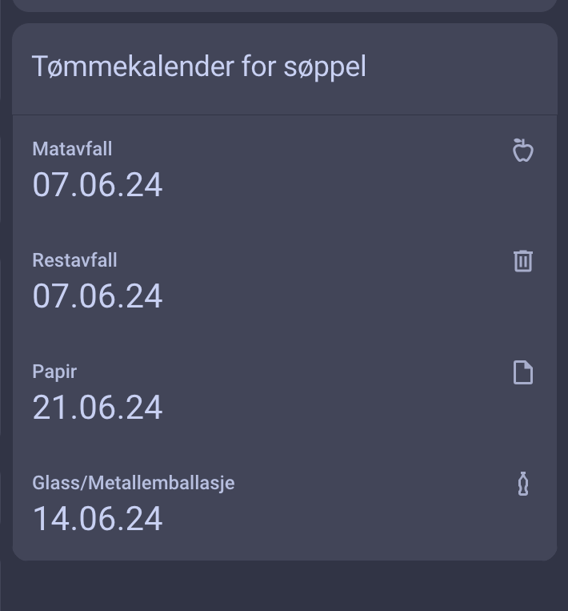

# tommekalender
Tommekalender is a Home Assistant plugin that fetches and displays waste collection dates from HIKS. (https://www.hiks.no/privat/tommekalender/)

### Screenshot




### Installation

1. Download the Repository
 - Download the latest version of this repository as a ZIP file.
 - Extract the contents to your Home Assistant configuration directory.
2. Copy Files
 - Copy the met_alerts directory to your custom components directory:

```
cp -r tommekalender /config/custom_components/

```
3. Install Dependencies
 - Ensure you have the required dependencies installed. If you are using Home Assistant Supervised or Home Assistant OS, dependencies are managed for you.

### Configuration
1. Update configuration.yaml
 - Add the following configuration to your configuration.yaml file:

```yaml
sensor:
  - platform: tommekalender
    address: "Åsvegen 12, Østre Toten"

```

Replace address with the address for the location you want to monitor.

2. Restart Home Assistant
 - Restart Home Assistant to apply the changes:

```
sudo systemctl restart home-assistant.service
```

### Lovelace Dashboard Configuration
To display the HIKS data in your Lovelace dashboard, you can use the following configuration:

1. Entities Card for Basic Information
 - Add an entities card to your Lovelace dashboard: 
```yaml
type: custom:vertical-stack-in-card
title: Tømmekalender for søppel
cards:
  - type: custom:stack-in-card
    cards:
      - type: custom:vertical-stack-in-card
        cards:
          - type: entity
            entity: sensor.tommekalender_matavfall
            name: Matavfall
            icon: mdi:food-apple-outline
          - type: entity
            entity: sensor.tommekalender_restavfall
            name: Restavfall
            icon: mdi:trash-can-outline
          - type: entity
            entity: sensor.tommekalender_papir
            name: Papir
            icon: mdi:file-outline
          - type: entity
            entity: sensor.tommekalender_glass_metallemballasje
            name: Glass/Metallemballasje
            icon: mdi:bottle-soda-classic-outline

```

### Troubleshooting

Custom Element Doesn't Exist
 - If you see "Custom element doesn't exist: custom:vertical-stack-in-card," or "Custom element doesn't exist: custom:stack-in-card," make sure you have installed any necessary custom cards or use the recommended markdown configuration above.

### Contribution
We welcome contributions! If you find any issues or have suggestions for improvements, please open an issue or submit a pull request.

### License
This project is licensed under the MIT License. See the LICENSE file for details.
